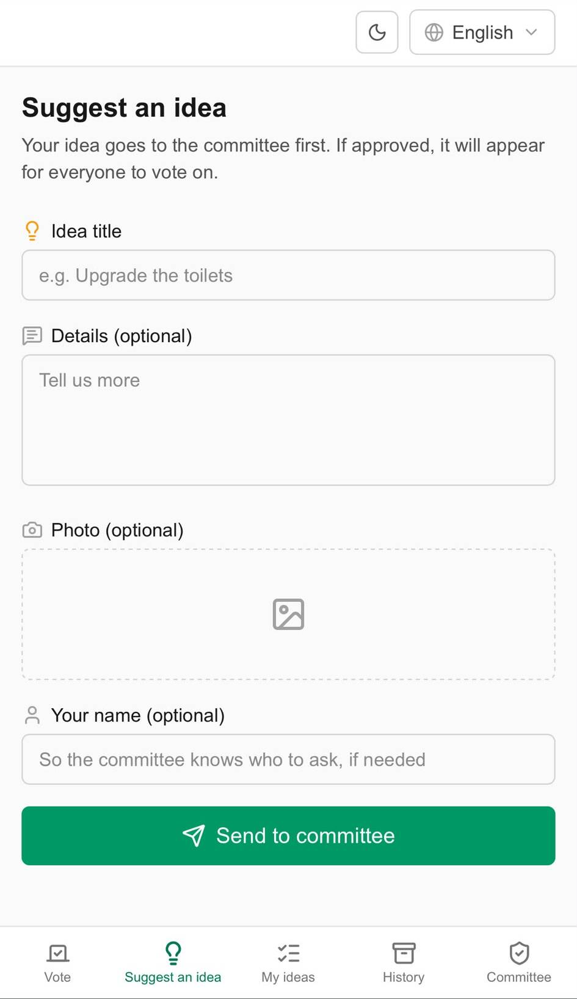
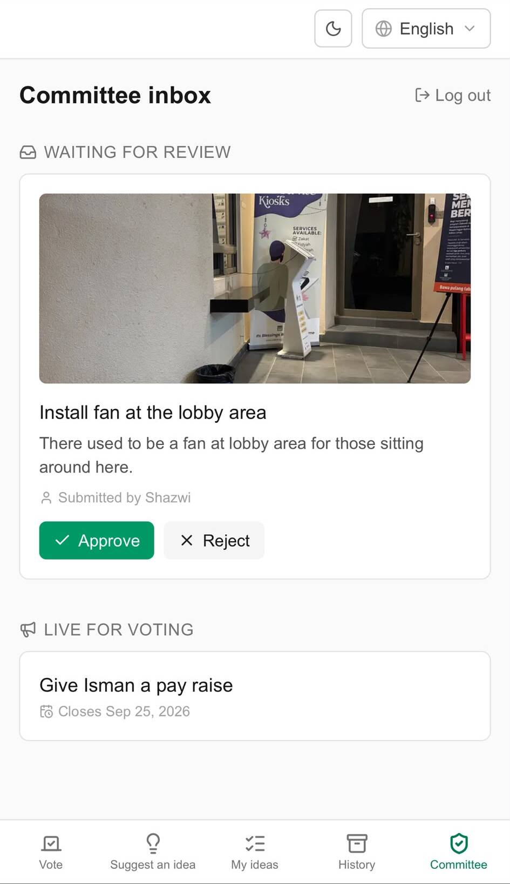
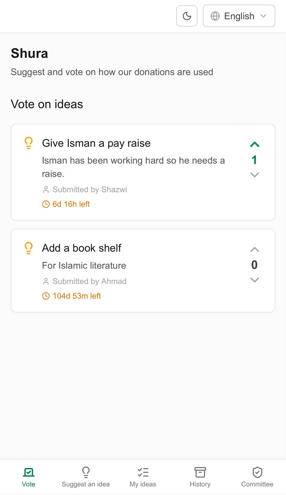

# Shura

A voting app for mosque congregants to suggest and vote on how donation funds should be spent.

## The problem

A mosque collects donations regularly, and the management committee wants to spend them on what matters most to the people who actually pray there — new toilets? aircon repair? a new carpet? To decide well, the committee needs an efficient way to reach out to the jemaah on the ground and hear what they'd prioritize, rather than guessing on their behalf.

Meanwhile, congregants who pray there every week have opinions on what needs fixing, but no channel to express them. Their only options are informal hallway conversations or nothing at all.

## The solution

Shura — named after the Islamic principle of communal consultation — lets any congregant suggest a spending idea and vote on ideas from others, while keeping the committee in control of what actually goes to a public vote.

<table>
  <tr>
    <td align="center" width="33%"><b>Suggest an idea</b></td>
    <td align="center" width="33%"><b>Committee inbox</b></td>
    <td align="center" width="33%"><b>Vote on ideas</b></td>
  </tr>
  <tr>
    <td></td>
    <td></td>
    <td></td>
  </tr>
</table>

**Flow:**

1. A congregant submits an idea (title, optional details, optional photo) — this goes straight to a **private committee inbox**, not public. This avoids spam, trolling, or public embarrassment for rejected ideas.
2. The committee reviews each idea. Approving it requires setting a **voting deadline**; rejecting it can include an optional note so the submitter has closure on why.
3. Approved ideas appear on the public **Vote** tab for everyone to see and vote on, Reddit-style (upvote/downvote, one vote per device, switchable up to neutral before flipping to the opposite direction).
4. Once an idea's deadline passes, it moves automatically to the **History** tab as a read-only record of the final tally — no separate "close voting" action needed.
5. Congregants can track their own submissions under **My Ideas**, editing or deleting them while still pending, and see the committee's decision (and reason, if rejected) once resolved.

### Voting integrity, honestly

This is an honor-system design, not a fraud-proof one — a deliberate tradeoff. There's no login, no phone verification, no ID check. A device is identified by a random ID stored in `localStorage`; the server enforces one vote per device per idea at the database level. Someone determined to game it could clear their browser storage or use another device. For a low-stakes community decision like "which repair should we prioritize," this friction is intentionally minimal — the goal is convenience for elderly and non-technical congregants, not defeating a determined bad actor.

### Language

Singapore/Malaysia mosque congregations are linguistically mixed. The UI (buttons, labels, navigation) is available in **English, Bahasa Melayu, Bengali, Tamil, Hindi, and Urdu**, switchable anytime via the language picker. Right-to-left layout is handled automatically for Urdu.

User-submitted idea text is **automatically translated** into all six languages on submit and edit (via an LLM through OpenRouter), so a congregant browsing in Tamil can read an idea originally typed in English, and vice versa. If translation fails or isn't configured, the app falls back to showing the original text — translation is a convenience layer, never a blocker to using the app.

## Where AI is used

1. **Runs with AI, at runtime.** Idea translation (see above) calls `google/gemini-2.5-flash-lite` through OpenRouter each time an idea is submitted or edited, to translate the title/description into the app's other five languages. This is the only AI call that happens after deployment — voting, moderation, and everything else is plain application logic with no AI involved.

## Tech stack

- **Next.js** (App Router) + **Tailwind CSS** — frontend, deployed on Vercel
- **Neon Postgres** + **Drizzle ORM** — data (ideas, votes)
- **Vercel Blob** — photo uploads
- **next-intl** — i18n / locale routing
- **OpenRouter** (`google/gemini-2.5-flash-lite`) — idea translation
- **Framer Motion** — micro-interactions (vote bursts, transitions)

## Running locally

```bash
npm install
npm run dev
```

Requires a `.env.local` with `DATABASE_URL` (Neon), `BLOB_READ_WRITE_TOKEN` (Vercel Blob), `ADMIN_PASSWORD` + `ADMIN_SESSION_SECRET` (committee login), and optionally `OPENROUTER_API_KEY` (idea translation).

Schema changes: `npx dotenv-cli -e .env.local -- npx drizzle-kit push`
